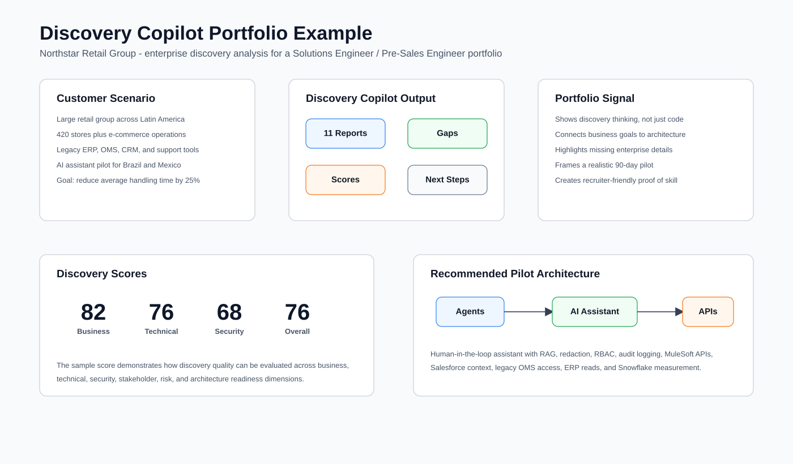

# Discovery Copilot

Discovery Copilot is a Python command-line application that helps enterprise
pre-sales teams turn raw customer discovery notes into structured technical and
business documentation.

It is designed for Pre-Sales Engineers, Solutions Engineers, Sales Engineers,
and Solution Architects who need to improve discovery quality, identify gaps,
and prepare internal briefings after customer meetings.

## Problem Statement

Customer discovery notes are often messy, incomplete, and hard to convert into
useful internal documentation. This slows down solution design, technical
validation, proof-of-concept planning, and handoff to engineering or product
teams.

Discovery Copilot uses the OpenAI API to analyze `.txt` and `.md` notes and
generate a complete set of Markdown reports that expose business context,
requirements, risks, missing information, next questions, and recommended next
steps.

## Features

- Python-only command-line workflow
- Supports `.txt` and `.md` input files
- Generates 11 structured Markdown reports
- Identifies explicit and implicit technical requirements
- Highlights discovery gaps and missing questions
- Scores discovery quality across key pre-sales dimensions
- Produces a customer meeting brief for internal teams
- Uses environment variables for API configuration
- Handles missing files, invalid formats, empty documents, missing API keys,
  rate limits, and API failures gracefully

## Generated Reports

Running the application creates an `output/` directory containing:

- `Executive Summary.md`
- `Customer Profile.md`
- `Business Challenges.md`
- `Technical Requirements.md`
- `Discovery Gaps.md`
- `Recommended Next Questions.md`
- `Customer Meeting Brief.md`
- `Solution Recommendations.md`
- `Discovery Quality Score.md`
- `Discovery Maturity Assessment.md`
- `Next Steps.md`

## Requirements

- Python 3.9 or newer
- OpenAI API key

## Installation

Create and activate a virtual environment:

```bash
python -m venv .venv
source .venv/bin/activate
```

Install dependencies:

```bash
pip install -r requirements.txt
```

Create your environment file:

```bash
cp .env.example .env
```

Then add your API key:

```env
OPENAI_API_KEY=your_api_key_here
```

Optional:

```env
OPENAI_MODEL=gpt-4o-mini
```

## Usage

Run Discovery Copilot with a supported input file:

```bash
python main.py input/sample_discovery_notes.md
```

On systems where `python` is not available, use `python3`:

```bash
python3 main.py input/sample_discovery_notes.md
```

You can also use your own meeting notes:

```bash
python main.py input/customer_meeting.md
```

or:

```bash
python main.py input/discovery_notes.txt
```

Successful execution prints the list of generated reports and writes them to
`output/`.

## Folder Structure

```text
discovery-copilot/
├── main.py
├── requirements.txt
├── README.md
├── .env.example
├── input/
│   └── sample_discovery_notes.md
├── output/
├── prompts/
│   ├── report_prompt.md
│   └── system_prompt.md
├── src/
│   ├── config.py
│   ├── exceptions.py
│   ├── generator.py
│   ├── input_loader.py
│   ├── openai_client.py
│   └── reports.py
└── utils/
    └── files.py
```

## Example Outputs

Discovery Copilot turns raw notes into executive-ready and engineering-ready
Markdown documents. Example report content includes:

- Executive summary for leadership review
- Customer profile and stakeholder map
- Explicit and inferred requirements
- Security, integration, scalability, and infrastructure requirements
- Missing discovery questions
- Recommended second-meeting questions
- Discovery quality score and maturity assessment
- Prioritized next-step action plan

## Portfolio Example: Northstar Retail Group

The repository includes a complete fictional enterprise scenario for
**Northstar Retail Group**, a large retail company with 420 stores, e-commerce
operations, customer support teams, and legacy systems across Latin America.
The example is designed to make the repository easy to evaluate for Solutions
Engineer and Pre-Sales Engineer roles.

Explore the sample package:

- [Discovery notes](examples/northstar_retail_group/discovery_notes.md)
- [Generated output reports](examples/northstar_retail_group/generated_outputs)
- [Consolidated discovery report](examples/northstar_retail_group/discovery_report.md)
- [Solution flow diagram - Mermaid](examples/northstar_retail_group/visuals/solution_flow.mmd)
- [Target architecture diagram - Mermaid](examples/northstar_retail_group/visuals/target_architecture.mmd)
- [Portfolio overview visual - SVG](examples/northstar_retail_group/visuals/portfolio_overview.svg)
- [Discovery score chart data](examples/northstar_retail_group/chart_data/discovery_scores.csv)
- [Requirements coverage chart data](examples/northstar_retail_group/chart_data/requirements_coverage.csv)

### Example Usage With Northstar Notes

```bash
python3 main.py examples/northstar_retail_group/discovery_notes.md
```

The command generates Markdown reports in `output/`. The repository also
includes prebuilt sample reports in
`examples/northstar_retail_group/generated_outputs/` so reviewers can inspect
the expected portfolio output without running the application.

### Visual Portfolio Preview



### Sample Discovery Score

| Category | Score |
| --- | ---: |
| Business Understanding | 82 |
| Technical Understanding | 76 |
| Security Understanding | 68 |
| Stakeholder Mapping | 84 |
| Requirements Completeness | 71 |
| Risk Identification | 79 |
| Architecture Readiness | 74 |
| Overall Discovery Score | 76 |

### Requirements Coverage

| Area | Coverage |
| --- | ---: |
| Business Requirements | 80% |
| Technical Requirements | 69% |
| Security Requirements | 58% |
| Integration Requirements | 73% |
| Infrastructure Requirements | 56% |
| Success Metrics | 50% |
| Stakeholder Mapping | 88% |

### Why This Matters For Portfolio Review

This example shows practical pre-sales judgment: the tool does not only produce
summaries. It identifies gaps, separates explicit and inferred requirements,
scores discovery quality, proposes a focused pilot, and gives a hiring manager
clear evidence of enterprise discovery and solution-framing ability.

## Future Roadmap

These improvements are intentionally documentation-only and are not implemented
in this version:

- PDF support
- DOCX support
- Audio transcript support
- Streamlit interface
- CRM integration
- Salesforce integration
- HubSpot integration
- Microsoft Teams integration
- Slack integration
- RAG using internal documentation
- Vector database support
- Multi-language support
- Dashboard
- Docker deployment
- Batch processing

## Design Philosophy

Discovery Copilot is not a chatbot. It is a focused productivity tool for
enterprise pre-sales work. The emphasis is on structured outputs, reasoning,
discovery quality, and practical documentation that saves time after customer
meetings.
