# Northstar Retail Group Enterprise Example

This fictional example shows how Discovery Copilot supports a realistic
enterprise pre-sales discovery workflow.

Northstar Retail Group is a large retail company with 420 stores, e-commerce
operations, customer support teams, and legacy systems across Latin America. The
scenario demonstrates practical Solutions Engineer and Pre-Sales Engineer work:
discovery analysis, requirement extraction, gap identification, solution
framing, and architecture communication.

## What This Example Demonstrates

- Enterprise discovery note-taking
- Technical and business requirement extraction
- Gap analysis and follow-up question generation
- Solution recommendation framing
- Discovery scoring and maturity assessment
- Architecture communication through diagrams
- Executive-ready report packaging

## Files

- `discovery_notes.md` - raw fictional discovery notes
- `generated_outputs/` - sample output reports generated from the notes
- `output_previews/` - PNG previews for each generated report
- `discovery_report.md` - consolidated executive and technical report
- `visuals/solution_flow.mmd` - Mermaid solution flow diagram
- `visuals/target_architecture.mmd` - Mermaid target architecture diagram
- `visuals/overview_banner.png` - repository hero visual
- `visuals/discovery_copilot_workflow.png` - product workflow visual
- `visuals/northstar_target_architecture.png` - customer target architecture visual
- `visuals/discovery_scores_and_coverage.png` - score and coverage chart visual
- `chart_data/discovery_scores.csv` - discovery quality score data
- `chart_data/requirements_coverage.csv` - requirements coverage data

## Visual Preview

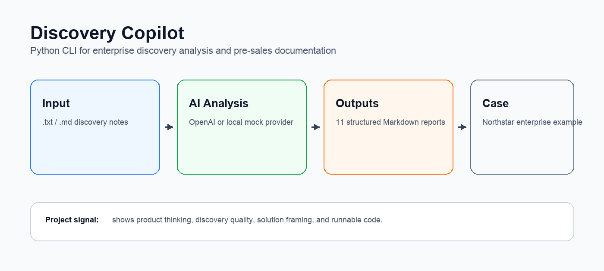

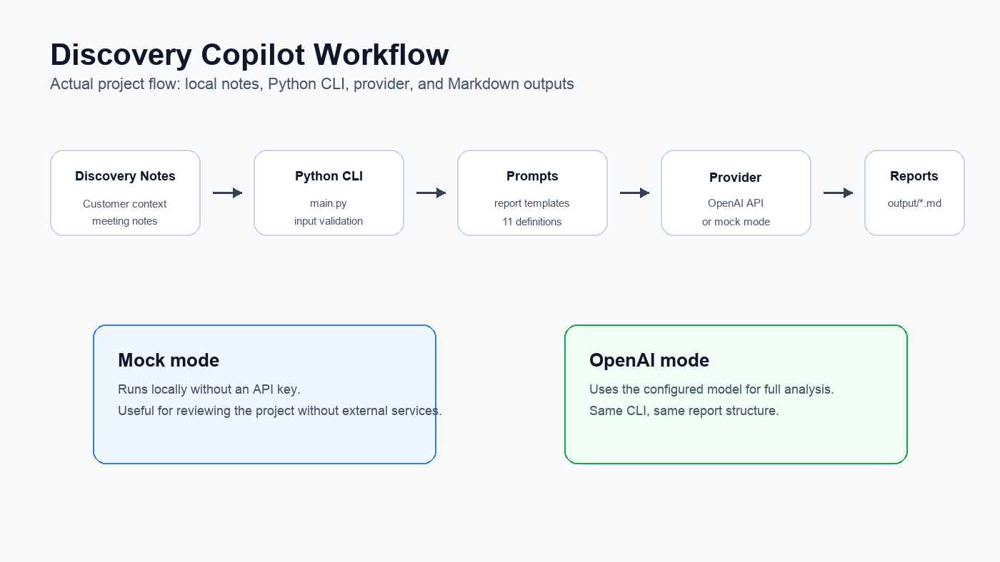

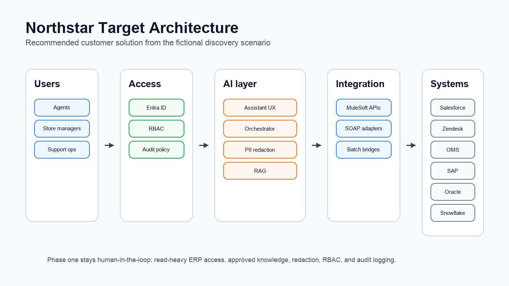

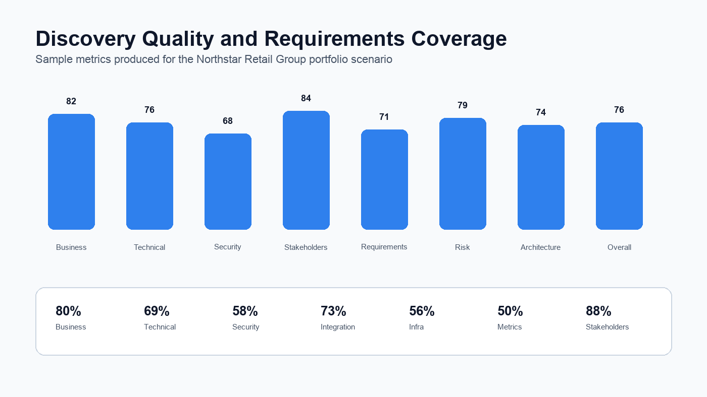

## Generated Output Previews

| Report | Preview |
| --- | --- |
| [Executive Summary](generated_outputs/Executive%20Summary.md) | 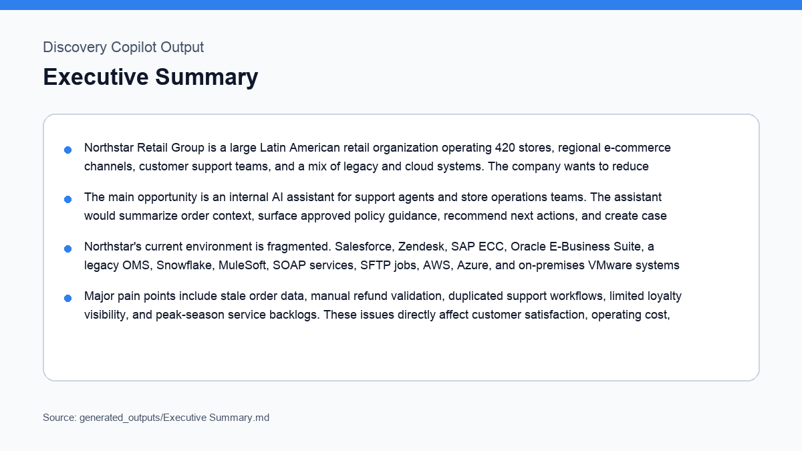 |
| [Customer Profile](generated_outputs/Customer%20Profile.md) | 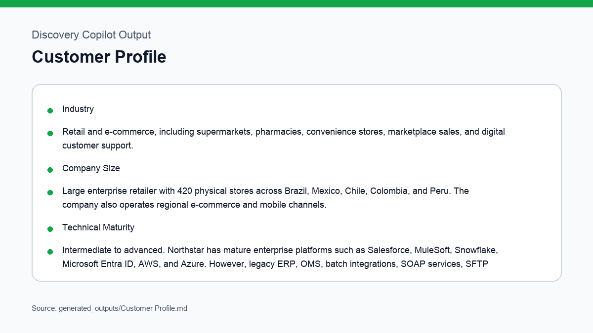 |
| [Business Challenges](generated_outputs/Business%20Challenges.md) | 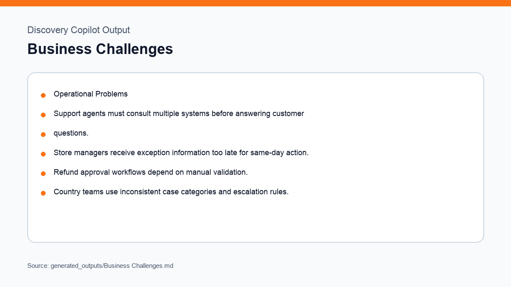 |
| [Technical Requirements](generated_outputs/Technical%20Requirements.md) | 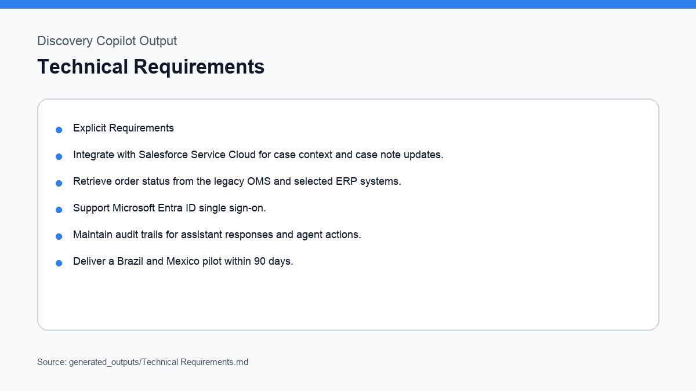 |
| [Discovery Gaps](generated_outputs/Discovery%20Gaps.md) | 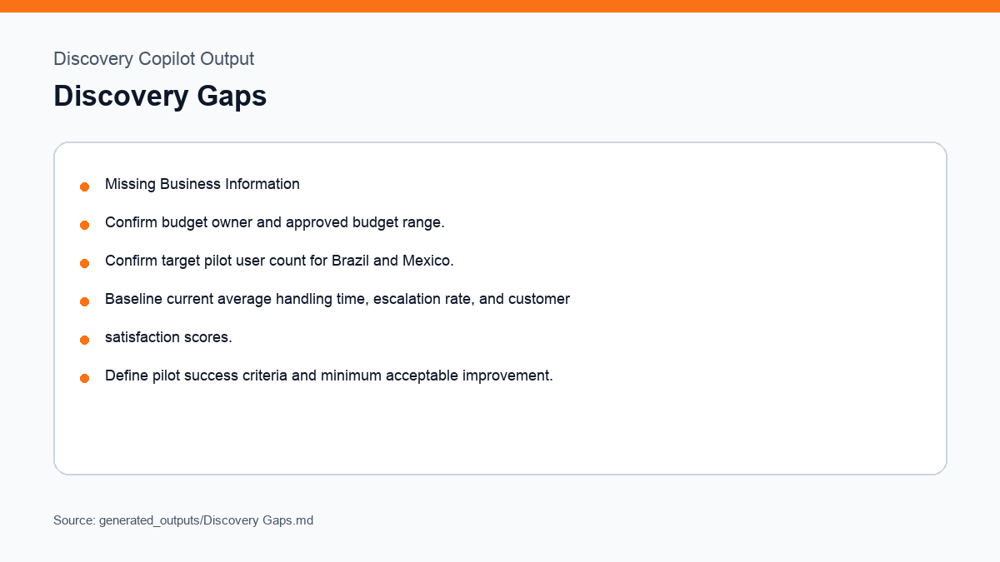 |
| [Recommended Next Questions](generated_outputs/Recommended%20Next%20Questions.md) | 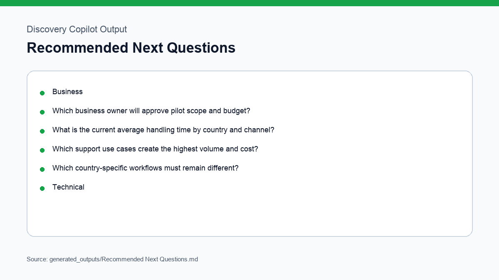 |
| [Customer Meeting Brief](generated_outputs/Customer%20Meeting%20Brief.md) | 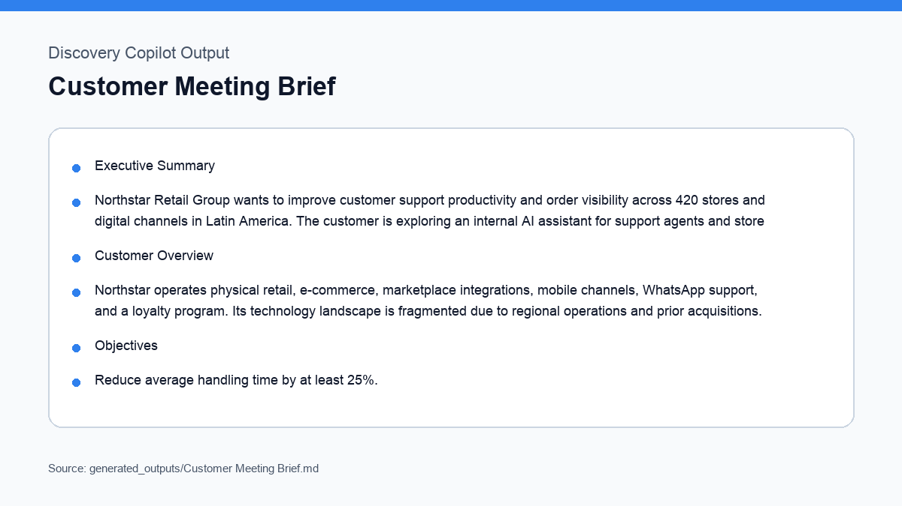 |
| [Solution Recommendations](generated_outputs/Solution%20Recommendations.md) | 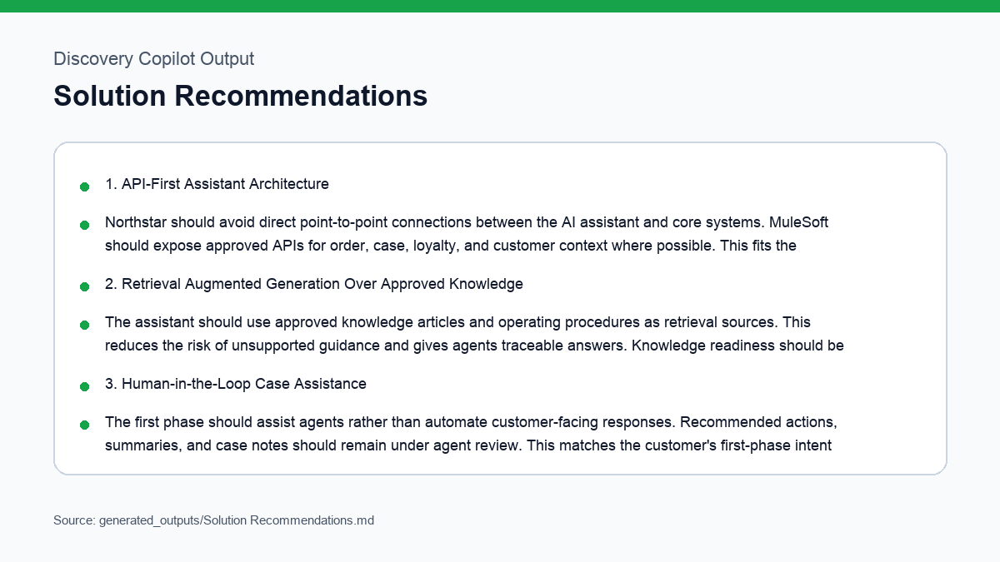 |
| [Discovery Quality Score](generated_outputs/Discovery%20Quality%20Score.md) | 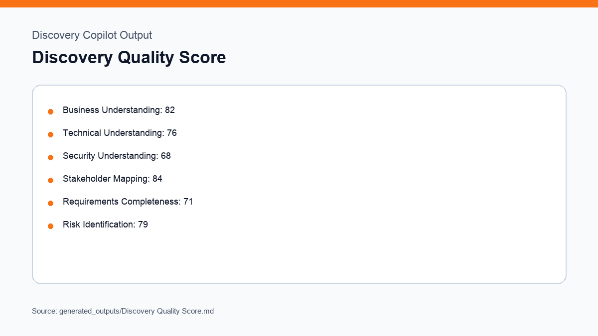 |
| [Discovery Maturity Assessment](generated_outputs/Discovery%20Maturity%20Assessment.md) | 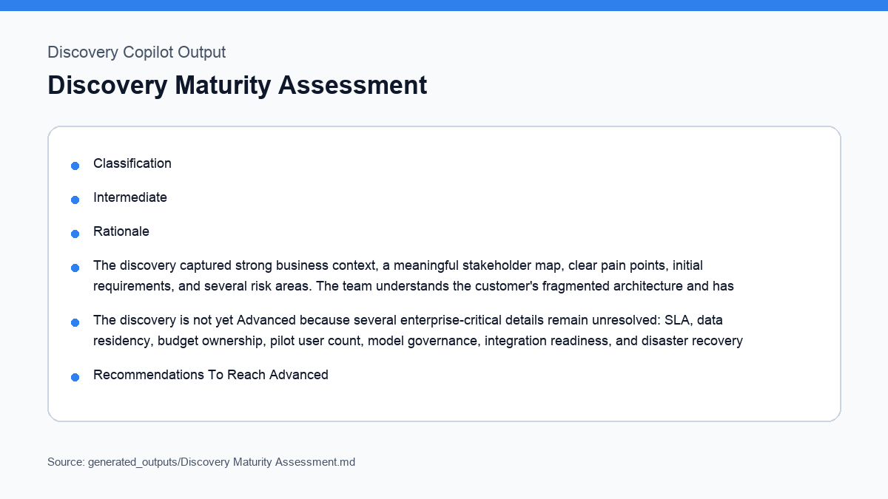 |
| [Next Steps](generated_outputs/Next%20Steps.md) | 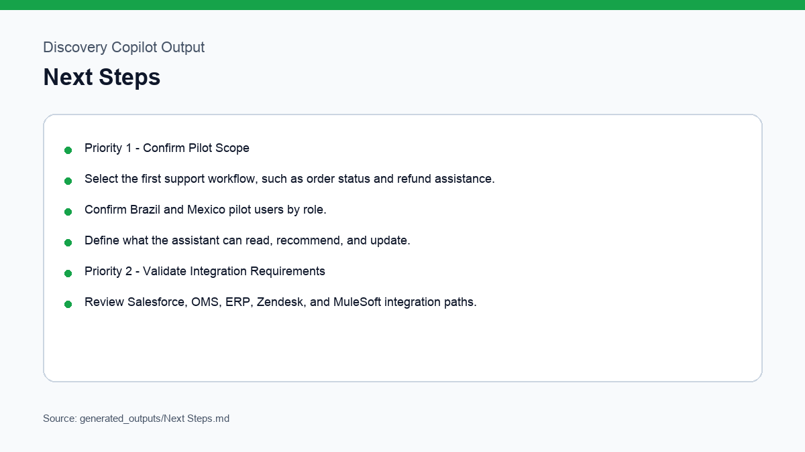 |

## Regenerating Visuals

The PNG visuals are committed for easy viewing. To regenerate them after
editing the visual script, install development dependencies and run:

```bash
pip install -r requirements-dev.txt
python3 scripts/generate_example_images.py
```

## Suggested Walkthrough

1. Start with the raw discovery notes to show realistic customer ambiguity.
2. Open the generated output files to show structured analysis.
3. Review the consolidated discovery report as an internal handoff artifact.
4. Use the diagrams to explain solution thinking and architecture tradeoffs.
5. Use the chart data to show how discovery quality can be measured.

## Professional Signal

This example is intended to show more than coding ability. It demonstrates the
practical judgment expected from a Solutions Engineer: understanding business
outcomes, translating messy notes into requirements, exposing gaps, framing a
safe pilot, and communicating architecture clearly.
